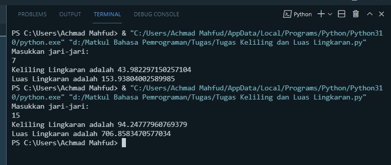

# <p align="center"> **Tugas Program Keliling dan Luas Lingkaran**

<p align="justify"> Tugas Pemgrogaman membuat program menghitung Luas & Keliling Lingkaran menggunakan bahasa pemrograman python.

---
<br>

# **[Tugas 6](https://github.com/AchmadMahfud26/Tugas6/blob/main/Tugas%20Keliling%20dan%20Luas%20Lingkaran.py)**
<p align="justify"> Berisi syntax menghitung Luas & Keliling dalam bahasa pemrograman python.

- Import Math, berfungsi untuk melakukan proses Matematika.
```sh
import math
```
- Input jari-jari, menggunakan variabel integer.
```sh
jari = int(input('Masukan jari-jari:\n'));
```
- Menghitung proses keliling lingkaran.
```sh
//Math.pi berfungsi untuk menampilkan pi (3.14)

rumusKeliling = 2 * math.pi * jari;
```
- Menghitung proses luas lingkaran.
```sh
//Math.pi berfungsi untuk menampilkan pi (3.14)
//** berfungsi untuk Exponentiation

rumusLuas = jari ** 2 * math.pi;
```
- Print luas & keliling lingkaran.
```sh
print('Keliling Lingkaran adalah ', rumusKeliling);
print('Luas Lingkaran adalah ', rumusLuas);
```
# <p align="center"> **Hasil Output Program Luas & Keliling Lingkaran**


